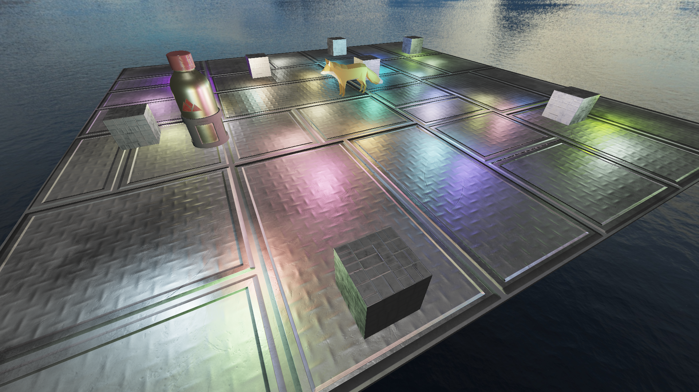

# FinalProject2026
My final year university project, implementing an extensible, physically-based Forward+ renderer.



## System Requirements
- Graphics card that supports Vulkan 1.0 or newer, or Metal (Apple Silicon only)
- For building: requires .NET 10 SDK

## Running
From the root directory of the project:
```bash
# Build the project
dotnet build src/Demo -c Release

# cd to the output directory and run
cd src/Demo/bin/Release/net10.0
./Demo OR ./Demo.exe on Windows
```

Unfortunately `dotnet run` will not work as the project relies on the current working directory being the same location as the project itself, leading to a crash.

## Usage
The demo starts in full-screen, and does not contain a quit button.
To quit, please use Alt+F4 (or your window manager's equivalent), or cmd+q on macOS.

The demo will automatically return to the menu after 30 seconds of inactivity. It will also auto-select a demo after
30 seconds of inactivity on the menu.
